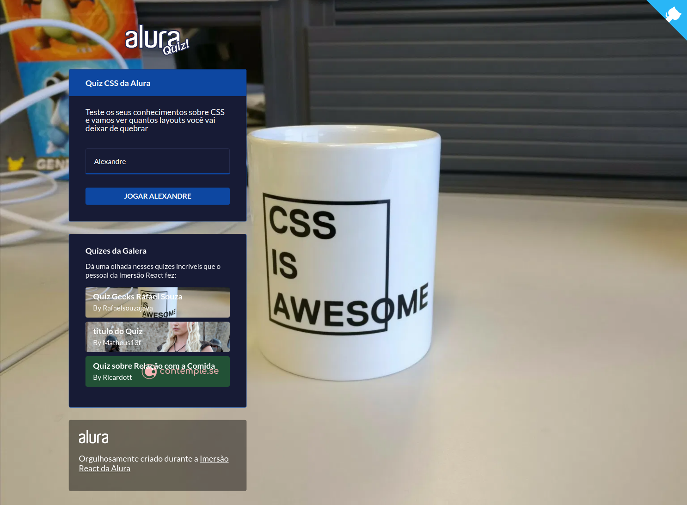

<h1 align="center">
  
  <br />
  <a href="https://www.linkedin.com/in/alexandre-costa-401699199">
    
  </a>
  <a href="https://github.com/alexandredev3/quiz-css-nextjs/blob/master/LICENSE.txt">
    
  </a>
  <a href="https://github.com/alexandredev3/quiz-css-nextjs/issues">
    
  </a>
  <a href="https://github.com/alexandredev3/quiz-css-nextjs/network">
    
  </a>
  <a href="https://github.com/alexandredev3/quiz-css-nextjs/stargazers">
    
  </a>
</h1>
<p align="center">
  <a href="#page_facing_up-descrição">Descrição</a>&nbsp;&nbsp;&nbsp;|&nbsp;&nbsp;&nbsp;
  <a href="#paperclip-links">Links</a>&nbsp;&nbsp;&nbsp;|&nbsp;&nbsp;&nbsp;
  <a href="#-tecnologias">Tecnologias</a>&nbsp;&nbsp;&nbsp;|&nbsp;&nbsp;&nbsp;
  <a href="#clipboard-Funcionalidades">Funcionalidades</a>&nbsp;&nbsp;&nbsp;|&nbsp;&nbsp;&nbsp;
  <a href="#closed_book-instalação">Instalação</a>&nbsp;&nbsp;&nbsp;|&nbsp;&nbsp;&nbsp;
  <a href="#man-Autor">Autor</a>&nbsp;&nbsp;&nbsp;|&nbsp;&nbsp;&nbsp;
  <a href="#memo-Licença">Licença</a>
</p>

<div align="center">

</div>

## :page_facing_up: Descrição
Projeto feito na Imersão React NextJS.

## :paperclip: Links
No link abaixo você encontra o link da Aplicação Online.

- [Production App](https://quiz-css.alexandredev3.vercel.app/)

## 🛠 Tecnologias
Este projeto foi desenvolvido com as seguintes tecnologias

- [Next.js](https://nextjs.org/)
- [React.js](https://pt-br.reactjs.org/)
- [TypeScript](https://www.typescriptlang.org/)
- [MongoDB](https://www.mongodb.com/)
- [StyledComponents](https://styled-components.com/)

## :clipboard: Funcionalidades
- [x] Jogar o quiz.
- [x] Jogar o quiz de outras pessoas.

## :closed_book: Instalação

### Pré-requisitos
Antes de começar, você vai precisar ter instalado em sua máquina as seguintes ferramentas:
[Git](https://git-scm.com), [Node.js](https://nodejs.org/en/).
Além disto é bom ter um editor para trabalhar com o código como [VSCode](https://code.visualstudio.com/)

Antes de seguir os passos a abaixo, preencha todas as variaveis ambientes, para saber quais variaves são necessárias, abra o aquivo .env.development.

```bash
# Clone este repositório
$ git clone https://github.com/alexandredev3/quiz-css-nextjs.git

# Vá para a pasta quiz-css-nextjs
$ cd quiz-css-nextjs

# Instale as dependências
$ yarn

# Execute a aplicação em modo de desenvolvimento
$ yarn dev

# O App inciará na porta 3000 - url <http://localhost:3000>
```

## :man: Autor

<a href="https://github.com/alexandredev3/">
 
 <br />
 <sub><b>Alexandre Costa</b></sub>
</a>


Feito com ❤️ por Alexandre Costa :wave::wave: Entre em contato!🚀

<a href="https://www.linkedin.com/in/alexandre-costa-401699199">
  
</a>


## :memo: Licença

Copyright © 2020 [Alexandre Costa](https://github.com/alexandredev3).<br />
This project is [MIT](./LICENSE.txt) licensed.
